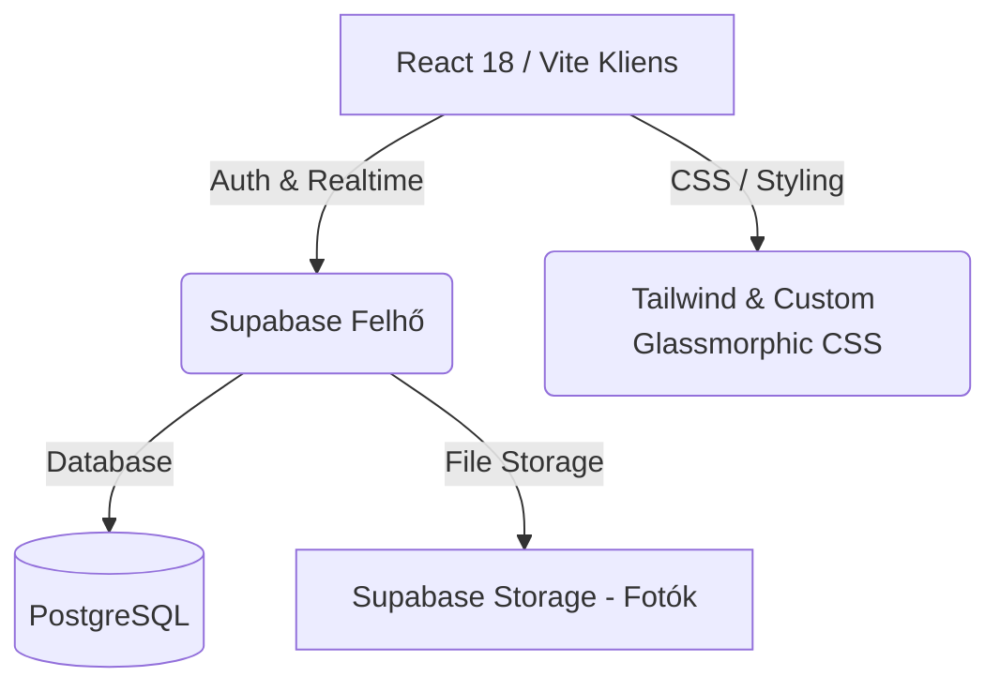

# VoltDesk · Felhasználói Kézikönyv & Rendszerdokumentáció
*Prémium, Apple-Style Napelem-telepítési és Villanyszerelési Munkafolyamat-kezelő Rendszer*

---

> [!NOTE]
> Ez a dokumentum az **VoltDesk** szoftver teljes körű üzleti és műszaki leírása. Az anyag alkalmas az alkalmazás értékesítése (eladása) során hivatalos felhasználói kézikönyvként és rendszer-specifikációként az új tulajdonos vagy a végfelhasználók számára.

---

## 📋 Tartalomjegyzék
1. [Rendszer Áttekintés & Termékfilozófia](#1-rendszer-áttekintés--termékfilozófia)
2. [Technológiai Stack & Architektúra](#2-technológiai-stack--architektúra)
3. [Szerepkörök és Jogosultságkezelés (RBAC)](#3-szerepkörök-és-jogosultságkezelés-rbac)
4. [Részletes Modulismertető](#4-részletes-modulismertető)
    - [4.1 Műszerfal & Toast Értesítések](#41-műszerfal--toast-értesítések)
    - [4.2 Projekt Részletei & Élő Napelem Telemetria](#42-projekt-részletei--élő-napelem-telemetria)
    - [4.3 Valós Idejű Belső Chat](#43-valós-idejű-belső-chat)
    - [4.4 Fotódokumentáció & Hiba/Akadálykezelés](#44-fotódokumentáció--hibaakadálykezelés)
    - [4.5 Napi Munkalap (Timesheet)](#45-napi-munkalap-timesheet)
    - [4.6 Adminisztrátori Pénzügyek & Könyvelési Adatlap](#46-adminisztrátori-pénzügyek--könyvelési-adatlap)
5. [Lépésről Lépésre Útmutatók](#5-lépésről-lépésre-útmutatók)
    - [5.1 Szerelő (Dolgozó) Napi Munkafolyamat](#51-szerelő-dolgozó-napi-munkafolyamat)
    - [5.2 Adminisztrátori Teendők](#52-adminisztrátori-teendők)
6. [Üzemeltetés & Hibaelhárítás](#6-üzemeltetés--hibaelhárítás)

---

## 1. Rendszer Áttekintés & Termékfilozófia

A **VoltDesk** egy kimondottan napelem-telepítő és villanyszerelő vállalkozások számára fejlesztett, **mobil-első, felhőalapú munkafolyamat- és pénzügy-kezelő alkalmazás**. 

### Miért egyedülálló a VoltDesk?
* **Apple-Style Design**: Minimalista, üveghatású (glassmorphic) vizuális elemek, magas kontrasztú, kifejezetten kültéri munkavégzésre (vakító napsütésre) optimalizált színhierarchia (`--t1`, `--t2`, `--t3` szövegtartományok).
* **Nincs felesleges adminisztráció**: A szerelők másodpercek alatt rögzíthetik a munkaidőt, tölthetnek fel fotókat és jelenthetnek be hibákat.
* **Valós idejű szinkronizáció**: A Supabase Realtime motor segítségével a chat és a státuszok azonnal frissülnek az összes eszközön.
* **Mobil-specifikus kialakítás**: Nincs iOS auto-zoom fókuszáláskor, 100dvh-s notch- és biztonsági sáv (notch-safe) követés a tökéletes görgethetőségért.

---

## 2. Technológiai Stack & Architektúra

A VoltDesk a legmodernebb, legstabilabb és legköltséghatékonyabb felhőtechnológiákra épül:

* **Frontend**: React 18 (Vite-tel csomagolva a villámgyors és ultra-könnyű betöltésért).
* **Adatbázis & Backend**: Supabase (PostgreSQL), amely biztosítja a biztonságos sorszintű hozzáférés-védelmet (RLS).
* **Realtime engine**: Supabase Postgres Changes csatornák (chathez és azonnali státusz-frissítésekhez).
* **Fájltárolás**: Supabase Storage buckets (kategorizált projektfotókhoz és hibajelentésekhez).
* **Hostolás**: Netlify vagy Vercel (bármelyik statikus tárhelyen ingyenesen futtatható).

---

## 3. Jogosultságkezelés & Szerepkörök (RBAC)

A rendszerben két alapvető szerepkör létezik, amelyek szigorúan az e-mail címek alapján dőlnek el a regisztráció/belépés pillanatában.

### 🔐 1. Rendszergazda (Admin)
* **Kizárólagos e-mail címek**:
  1. `admin@voltdesk.hu`
  2. `avar.szilveszter@gmail.com`
* **Jogosultságok**:
  - Új projektek létrehozása, szerkesztése, lezárása (archiválása).
  - Dolgozók és órabérek kezelése.
  - Szerelők privát "Könyvelési Adatlapjának" megtekintése.
  - Projektek pénzügyi mérlegének kezelése és kifizetett/nem kifizetett státuszának állítása.
  - Hozzáférés a teljes `/finance` modulhoz.

### 👷 2. Szerelő (Dolgozó / Worker)
* **Jogosultság**: Bármely más e-mail címmel regisztrált felhasználó.
* **Korlátozások**:
  - Nem látja és nem nyithatja meg a Pénzügy (`/finance`) menüpontot. Ha mégis megpróbálja az URL-t beírni, a rendszer automatikusan és azonnal visszadobja a főoldalra.
  - Nem szerkesztheti a projekt alapadatait, árait, vagy a dolgozók fizetési adatait.
  - Kizárólag a saját napi munkalapjait rögzítheti, fotókat tölthet fel, használhatja a chatet és pipálhatja a feladatokat.

---

## 4. Részletes Modulismertető

### 4.1 Műszerfal & Toast Értesítések
Belépés után a felhasználót a Műszerfal (Dashboard) fogadja, amely Apple-style üveghatású csempéket használ:
* **Projektek Listája**: Rendezhető, szűrhető és kereshető listanézet.
* **💬 Globális Toast Értesítések**: Ha a háttérben új chat üzenet érkezik egy olyan projektben, amelyben a dolgozó érintett, a rendszer egy tartós, nem eltűnő (manuálisan bezárható) felugró üzenettel értesíti a felhasználót, így egyetlen fontos instrukció sem vész el.

---

### 4.2 Projekt Részletei & Élő Napelem Telemetria
Ez az alkalmazás szíve. Tartalmazza a megrendelő adatait, a **közvetlen telefonhívási lehetőséget akár 3 külön telefonszámhoz** (elsődleges, másodlagos és harmadlagos elérhetőség), és a feladatlistát.

#### ☀️ Demo Inverter Telemetria
Ha a projekt napelemes telepítésként lett megjelölve (`is_solar`), az admin aktiválhatja az inverter felügyeletet a gyártó megadásával (pl. *Fronius, SolarEdge, Huawei*):
* **Sci-Fi Apple műszerfal**: Élő, fluktuáló pillanatnyi kW teljesítményadatok.
* **Napi hozam összesítő**: kWh-ban kifejezett napi termelés.
* **Termelési Görbe (Ma)**: Egy lélegzetelállító zöld neon-fényű SVG szinusz görbe, amely kirajzolja a napfelkelte és naplemente közötti hozamgörbét, rajta egy pulzáló "Aktuális időpont" jelölővel.

---

### 4.3 Valós Idejű Belső Chat
A külső csoportos chat programok (pl. Telegram) helyett a szoftver **beépített belső chatet** használ:
* **Gyors elérés**: Közvetlenül a projekt tetején található.
* **Egyértelmű azonosítás**: Minden üzenet felett látható a küldő neve, beosztása (Admin/Szerelő) és a dolgozói sorszáma (`[ADM-01]`, `[EMP-04]`).

---

### 4.4 Fotódokumentáció & Hiba/Akadálykezelés
A helyszíni dokumentáció és a minőségellenőrzés legfontosabb eszköze.

* **Fénykép Ellenőrző Varázsló**: A fotó kiválasztása után a rendszer egy előnézeti modalt nyit meg.
* **Hiba bejelentése**: Ha a dolgozó a piros "Hiba / Akadály" kártyát választja, a rendszer **kötelezővé teszi** a hiba leírását. Enélkül a fotó nem küldhető be.
* **Javítás igazolása**: Ha egy hibát kijavítottak, a rendszer lehetőséget ad egy javítást igazoló fotó és leírás feltöltésére, ami összekapcsolódik az eredeti hibás bejegyzéssel.
* **Immerzív Képnézegető**: Bármelyik fotóra kattintva egy teljes képernyős, elhomályosított hátterű Apple-style képnézegető nyílik meg, részletes feltöltési adatokkal.

---

### 4.5 Napi Munkalap (Timesheet)
Az adminisztráció minimalizálása érdekében a napi munkalap űrlapja rendkívül szellős és logikus:
* **Dátum választó**: Külön sorban, bőséges hellyel a könnyű koppintáshoz.
* **Időtartam megadása**: Kezdés (Mettől) és Befejezés (Meddig) mezők egy kompakt, 2-oszlopos rácsban egymás mellett.
* **Munka jellege / Leírás**: Szabad szöveges mező a napközben elvégzett feladatok részletezésére.

---

### 4.6 Adminisztrátori Pénzügyek & Könyvelési Adatlap
Kizárólag az Adminisztrátorok számára elérhető, szigorúan védett modul.

* **Globális Pénzügyi Mutatók**:
  - **Szerződéses Összérték**: Az összes aktív projekt nettó vállalkozási díjának összege.
  - **Beérkezett Összeg**: A kifizetettnek jelölt projektek összege.
  - **Kintlévőség**: A még ki nem fizetett projektek összege.
* **Dolgozói Könyvelési Adatlap**:
  - Kilistázza az összes dolgozót.
  - Összegzi az adatbázisban rögzített **összes ledolgozott órát** a napi munkalapok alapján.
  - **Automatikus kifizetési kalkuláció**: Kiszámolja a ledolgozott órák és az órabér szorzatát (fizetendő összeg).
  - **Privát Adatlap felnyitás**: Az Admin egy kattintással megnyithatja a dolgozó összes bizalmas adatát (Szül. idő, Adóazonosító, TAJ szám, Bankszámlaszám, Vészhelyzeti telefonszám).

---

## 5. Lépésről Lépésre Útmutatók

### 5.1 Szerelő (Dolgozó) Napi Munkafolyamat

#### 1. Belépés az alkalmazásba
- Nyisd meg a VoltDesk URL-t a telefonodon.
- Add meg az e-mail címed és a jelszavad. (Első belépéskor a profilod automatikusan legenerálódik egy egyedi dolgozói sorszámmal).

#### 2. Napi munkalap kitöltése
- A Műszerfalon koppints az **"Órarend / Napi Lap"** csempére.
- Válaszd ki a mai dátumot, majd add meg mikor kezdted a munkát, és mikor fejezted be.
- Írd le röviden a munka leírását, majd nyomd meg a **"Munkalap Beküldése"** gombot.

#### 3. Projekt haladás követése és fotózás
- A Műszerfalon válaszd ki azt a projektet, amin éppen dolgozol.
- Pipáld ki az elvégzett teendőket a **"Teendők / Munkalap"** listában.
- A **"Fénykép készítése és beküldése"** gombbal készíts fotót a kész munkáról.
- Ha problémába ütközöl, készíts róla fotót, válaszd a piros *Hiba / Akadály* kártyát, **írd le pontosan mi a gond**, majd küldd be.

---

### 5.2 Adminisztrátori Teendők

#### 1. Új Projekt felvitele
- Lépj be admin e-mail címeddel.
- A Műszerfalon a projektek listájánál kattints az **"Új Projekt"** gombra.
- Töltsd ki a Megrendelő nevét, címét, vállalkozási díját (Ügyfél Ár), a kezdési/befejezési dátumot és a teendők listáját.
- **Kapcsolati adatok**: Megadhatod a Megrendelő elsődleges, valamint opcionálisan másodlagos és harmadlagos telefonszámát is a terepi kapcsolattartás megkönnyítéséhez.

#### 2. Hiba ellenőrzése és lezárása
- Ha egy szerelő hibát jelent be, a projekt adatlapján a fotónál azonnal megjelenik a piros jelzés és a leírás.
- Miután a szerelő feltöltötte a javítást igazoló fotót és a hiba státusza zöldre váltott (`Kijavítva`), ellenőrizheted az elvégzett munkát.

#### 3. Havi kifizetések és könyvelés
- Menj a **Pénzügyek** menüpontba.
- Ellenőrizd a havi kintlévőséget és a bejövő összegeket.
- A dolgozók listájánál látni fogod a szerelők ledolgozott óráit és a kalkulált munkabért.
- Kattints a dolgozó nevére a bizalmas bankszámlaszám és adóazonosító megtekintéséhez az utaláshoz.

#### 4. Projekt lezárása (Archiválás)
- Ha egy projekt 100%-ban elkészült, az adatlap alján kattints az **"Archiválás (100% Kész!)"** vagy a **"Projekt Lezárása"** gombra.

---

## 6. Üzemeltetés & Hibaelhárítás

### 🌐 Miért nem realtime a chat a helyszínen?
Ha a szerelő telefonján elment az internet (gyenge térerő a tetőn vagy pincében):
- Az alkalmazás biztonságosan pufferel. Amint a telefon újra 4G/5G hálózatra csatlakozik, a Supabase Realtime csatorna automatikusan újrakapcsolódik és letölti az üzeneteket, illetve beküldi a függőben lévő fotókat.

### 📸 Nem engedi a fotó feltöltését
- Ellenőrizd, hogy ha a piros "Hiba" opciót választottad, írtál-e szöveget a megjegyzés mezőbe. A rendszer hiba esetén kötelezővé teszi a leírást.
- Biztosítsd, hogy a szoftvernek engedélyezve van a kamerához való hozzáférés a telefon böngészőjében.

---
*VoltDesk · Ahol az Apple dizájn találkozik a precíz mérnöki munkával.*
